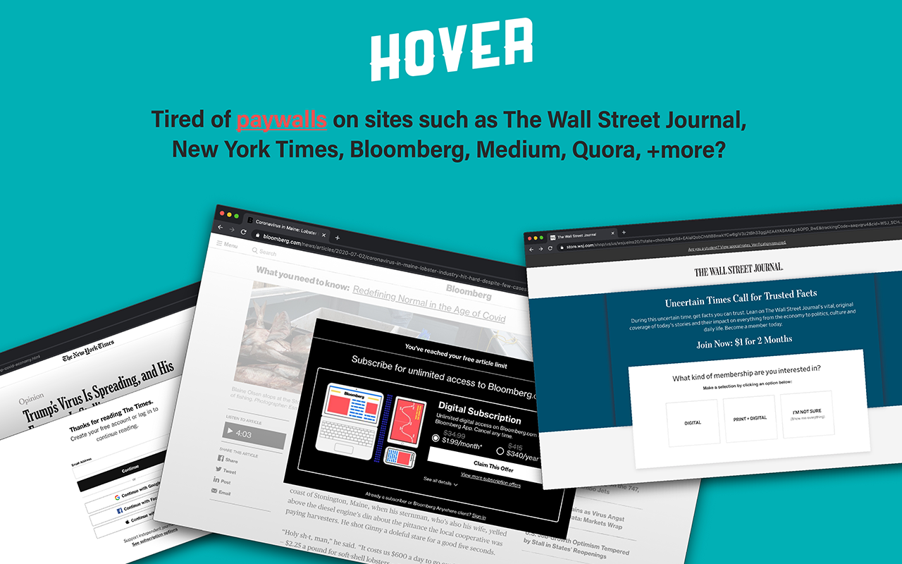
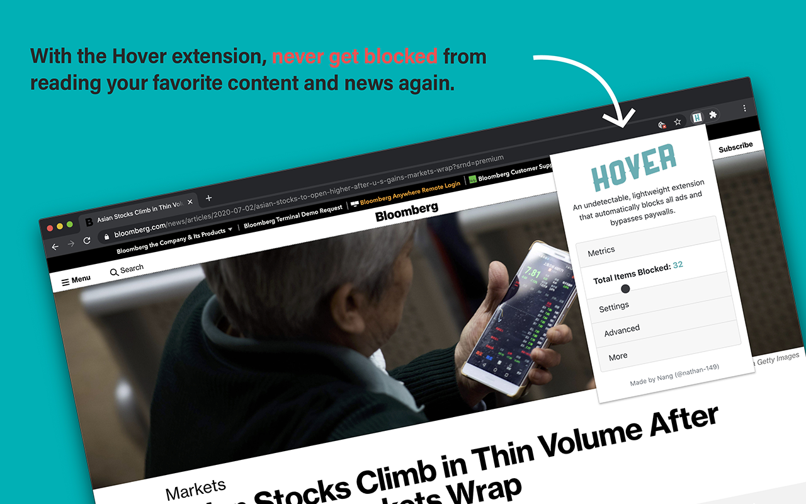
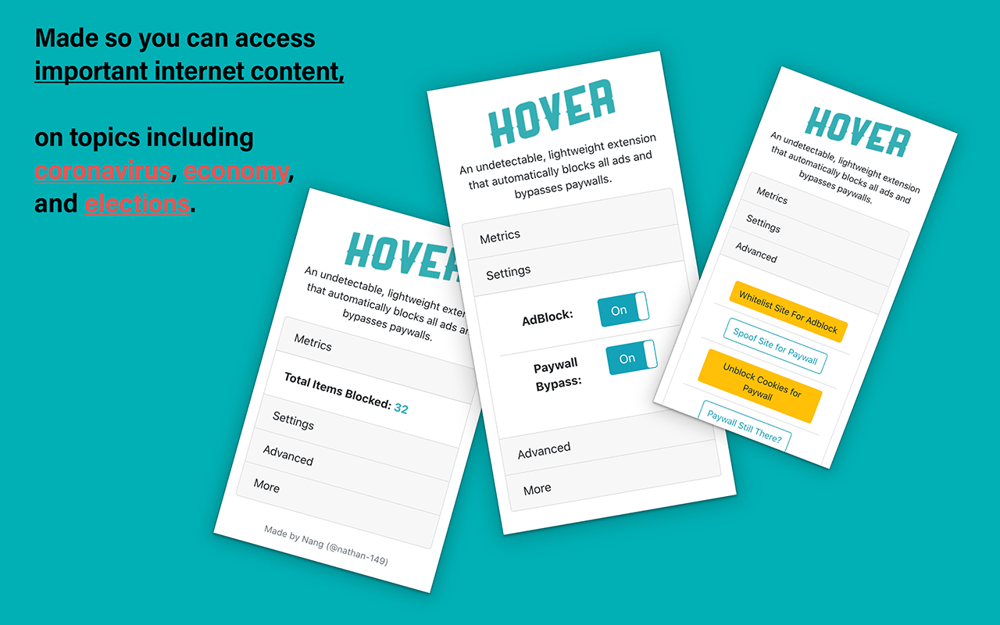

### An open-sourced extension that that bypasses paywalls and blocks ads. Made so you can access important information with ease and without distractions.





Access more content on the internet. Made so you can access important information, on topics like coronavirus and elections, with ease and without paywalls, subscription walls, ads, and tracking modules. \

## Read about how it works here: https://medium.datadriveninvestor.com/how-to-bypass-any-paywall-for-free-df87832cbff7

# Installation

## Download Locally: 
**Google Chrome**
1. Download this repo as a [ZIP file from GitHub](https://github.com/hover-inc/hover-extension/archive/master.zip).
2. Unzip the file and you should have a folder named `hover-extension-master`.
3. In Chrome go to the extensions page (`chrome://extensions`).
4. Enable Developer Mode.
5. Drag the `dist` folder that is in `hover-extension-master` onto anywhere on the Chrome page to import it! (do not delete the folder afterwards)
6. Enjoy!

## Download from the Chrome Web Store (10,000+ Downloads + 5/5 Rating) (Down because Google does not allow bypassing paywalls):
## https://chrome.google.com/webstore/detail/hover-paywall-bypasser/ajbennpkmbahpfdalicgaogjbfhngeok

# How To Use
Enable in Google Chrome, and you should see it on the top right along with the other extensions. \
To bypass paywalls on the website domain you're on, simply click on the "Bypass Paywalls" toggle button. \
It should work automatically! Enjoy :) \ \
If it doesn't work, go to advanced, and try different combinations of the strategies to bypass the paywall. Most of the time, enabling just one of them will do the trick, but it depends on the website. 

# How To Contribute
Fork the repository and improve Hover!
Make edits in src folder, and then run ```npm run build```. This will create the dist folder, which is used by browsers (see Download Locally Step 5).

Current stable version: 2.2.7
Dev version: 2.2.8

## Next Steps
Transfer into a Firefox extension. \
Make Hover work for more sites. \
Try to get back onto Google Chrome Store.

## Notes

-The only permissions/settings the extension utilizes are for webRequest and cookie functionality, and nothing more.

-May not work on some websites.


Disclaimer: 
Do not use this extension to violate the terms of service/use of any website.
